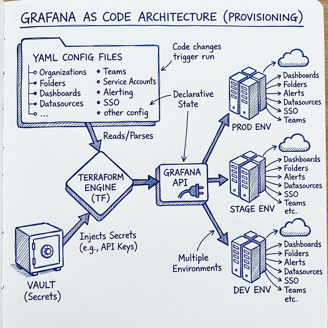
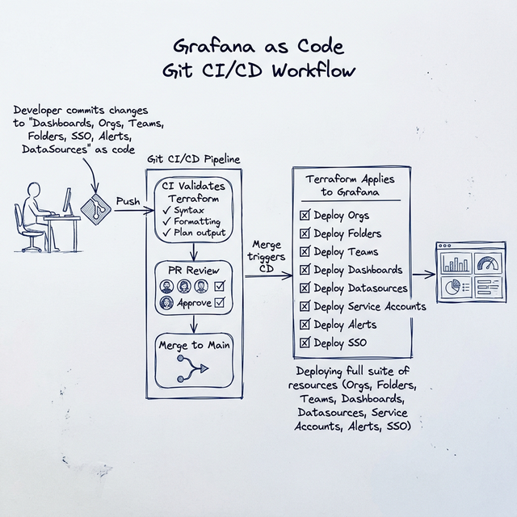
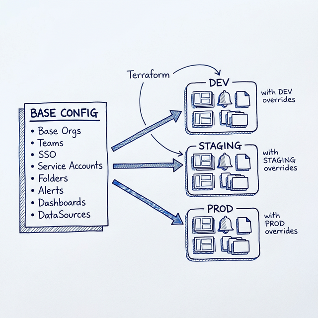
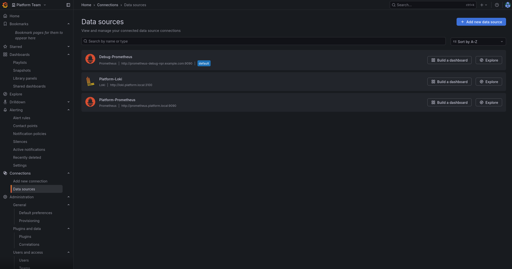

# Grafana as Code with Terraform

[](https://terraform.io)
[](https://registry.terraform.io/providers/grafana/grafana)
[](https://www.vaultproject.io/)
[](https://opensource.org/licenses/MIT)

Manage Grafana infrastructure as code using Terraform. This project provides a complete framework for managing multiple Grafana environments with multi-organization support, Keycloak SSO integration, and HashiCorp Vault for secrets management.



## 🎯 Features

- **Multi-Environment Support**: Separate configurations for NPR, PreProd, and Production
- **Multi-Organization**: Manage multiple Grafana organizations with role-based access
- **SSO Integration**: Keycloak authentication with organization and role mapping (including GrafanaAdmin support)
- **Secrets Management**: HashiCorp Vault integration for all sensitive credentials
- **Template-Based Configuration**: YAML/JSON templates for all Grafana resources
- **Dashboard as Code**: Version-controlled dashboards organized by folder structure
- **Full Alerting Support**: 
  - 20+ contact point types (email, webhook, Slack, PagerDuty, Opsgenie, Teams, Discord, Telegram, and more)
  - Complete alert rule parameters (no_data_state, exec_err_state, is_paused, notification_settings)
  - Mute timings configuration
- **Dynamic Datasources**: Full parameter support for all datasource types with type-specific json_data

## 📁 Project Structure

```
grafana-as-code/
├── main.tf                          # Main Terraform configuration
├── variables.tf                     # Input variables
├── outputs.tf                       # Output values
├── locals.tf                        # Local values and config loading
├── backend.tf                       # Remote state backend config
│
├── environments/                    # Environment-specific variables
│   ├── npr.tfvars                  # Non-Production environment
│   ├── preprod.tfvars              # Pre-Production environment
│   └── prod.tfvars                 # Production environment
│
├── config/                          # Configuration files (YAML)
│   ├── shared/                     # Shared across ALL environments
│   │   ├── organizations.yaml      # Organization definitions
│   │   ├── folders.yaml            # Folder structure (with org assignment)
│   │   ├── teams.yaml              # Team definitions (with org assignment)
│   │   ├── service_accounts.yaml   # Service accounts (with org assignment)
│   │   ├── datasources.yaml        # Shared datasources (org-specific)
│   │   ├── alerting/               # Shared alerting configs
│   │   │   ├── alert_rules.yaml
│   │   │   ├── contact_points.yaml
│   │   │   └── notification_policies.yaml
│   │   └── sso/
│   │       └── keycloak.yaml       # SSO configuration
│   │
│   ├── npr/                        # NPR environment configs (override shared)
│   │   ├── datasources.yaml        # NPR-specific datasources
│   │   ├── grafana-sso.ini
│   │   └── alerting/
│   │       ├── alert_rules.yaml    # NPR-specific alert rules
│   │       ├── contact_points.yaml # NPR-specific contacts
│   │       └── notification_policies.yaml
│   │
│   ├── preprod/                    # PreProd configs (same structure)
│   └── prod/                       # Production configs (same structure)
│
├── dashboards/                      # Dashboard JSON files
│   ├── shared/                     # Deployed to ALL environments
│   │   ├── infrastructure/         # Infrastructure monitoring
│   │   ├── applications/           # Application dashboards
│   │   ├── business/               # Business metrics
│   │   ├── slos/                   # SLO dashboards
│   │   └── alerts/                 # Alert overview dashboards
│   ├── npr/                        # NPR-only dashboards
│   ├── preprod/                    # PreProd-only dashboards
│   └── prod/                       # Prod-only dashboards
│
├── modules/                         # Terraform modules
│   ├── organizations/              # Organization management
│   ├── folders/                    # Folder management
│   ├── datasources/                # Datasource management
│   ├── dashboards/                 # Dashboard deployment
│   ├── alerting/                   # Alert rules & contacts
│   ├── teams/                      # Team management
│   ├── service_accounts/           # Service account management
│   └── vault/                      # Vault secrets integration
│
├── vault/                           # Vault configuration
│   ├── policies/
│   │   └── grafana-terraform.hcl   # Vault policy
│   └── scripts/
│       ├── setup-npr-secrets.sh    # NPR secrets setup
│       ├── setup-preprod-secrets.sh
│       ├── setup-prod-secrets.sh
│       ├── setup-all-secrets.sh    # All environments
│       ├── verify-secrets.sh       # Verify secrets exist
│       └── rotate-secret.sh        # Rotate individual secrets
│
├── docs/                            # Documentation
│   └── vault-integration.md        # Vault setup guide
│
├── backends/                        # Remote state configs
│   ├── npr.tfbackend
│   ├── preprod.tfbackend
│   └── prod.tfbackend
│
└── Makefile                         # Automation commands
```

## 🔄 Configuration Merge Behavior

All resources support a **shared + environment-specific** pattern:



| Resource | Shared Location | Env Location | Merge Key |
|----------|----------------|--------------|-----------|
| Datasources | `config/shared/datasources.yaml` | `config/{env}/datasources.yaml` | `uid` |
| Alert Rules | `config/shared/alerting/alert_rules.yaml` | `config/{env}/alerting/alert_rules.yaml` | `name` |
| Contact Points | `config/shared/alerting/contact_points.yaml` | `config/{env}/alerting/contact_points.yaml` | `name` |
| Notification Policies | `config/shared/alerting/notification_policies.yaml` | `config/{env}/alerting/notification_policies.yaml` | `org` |
| Dashboards | `dashboards/shared/{folder}/` | `dashboards/{env}/{folder}/` | filename |

**Override Behavior**: Environment-specific configs **override** shared configs with the same merge key.

**Example**:
- A datasource in `config/shared/datasources.yaml` with `uid: prometheus` → deployed to all envs
- A datasource in `config/npr/datasources.yaml` with `uid: prometheus` → overrides shared in NPR only

## 🏢 Organizations

| Organization | Purpose | Access |
|-------------|---------|--------|
| **Main Organization** | Default organization | Grafana Admins |
| **Public** | Shared dashboards for all users | All teams (Viewer only) |
| **Platform Team** | Infrastructure & platform monitoring | Platform engineers |
| **Application Team** | Application-specific dashboards | App developers |
| **Business Intelligence** | Business metrics & KPIs | BI analysts |

## 🌍 Environments

| Environment | Description | Grafana URL | Alert Sensitivity |
|-------------|-------------|-------------|-------------------|
| **npr** | Non-Production/Development | `http://localhost:3000` | Low |
| **preprod** | Pre-Production/Staging | `https://grafana-preprod.example.com` | Medium |
| **prod** | Production | `https://grafana.example.com` | High |



## 📸 Screenshots

### Multi-Organization Support
Manage multiple isolated organizations from a single Terraform configuration:


### SSO Integration with Keycloak
Single Sign-On login page with Keycloak integration:


### Datasources Management
Configured datasources deployed via Terraform:



### Keycloak Group Mapping
Map Keycloak groups to Grafana organizations and roles:


## 📋 Prerequisites

- **Terraform** >= 1.0.0
- **Grafana** instance(s) with admin access
- **HashiCorp Vault** for secrets management
- **Keycloak** (optional) for SSO authentication

## 🚀 Quick Start

### 1. Clone and Configure

```bash
git clone <repository-url>
cd grafana-as-code
```

### 2. Set Up Vault Secrets

```bash
# Start Vault (development mode)
vault server -dev

# In another terminal, set environment
export VAULT_ADDR='http://127.0.0.1:8200'
export VAULT_TOKEN='your-root-token'

# Run the setup script for your environment
./vault/scripts/setup-npr-secrets.sh

# Verify secrets
./vault/scripts/verify-secrets.sh npr
```

### 3. Initialize and Apply Terraform

```bash
# Initialize Terraform
terraform init

# Plan changes for NPR environment
terraform plan -var-file=environments/npr.tfvars

# Apply changes
terraform apply -var-file=environments/npr.tfvars
```

## ⚙️ Configuration

### Environment Variables

```bash
# Required: Vault configuration
export VAULT_ADDR='https://vault.example.com'
export VAULT_TOKEN='your-vault-token'

# Optional: Override Terraform variables
export TF_VAR_environment='npr'
```

### Vault Secrets Structure

All secrets are stored in Vault under the `grafana/` mount:

```
grafana/
├── {env}/grafana/auth                      # Grafana admin credentials
├── {env}/datasources/{name}                # Datasource credentials
├── {env}/alerting/contact-points/{name}    # Webhook tokens
└── {env}/sso/keycloak                      # SSO client secrets
```

### Using Vault for Datasources

Add `use_vault: true` to fetch credentials from Vault:

```yaml
# config/npr/datasources.yaml
datasources:
  - name: My Prometheus
    type: prometheus
    uid: prometheus-main
    url: http://prometheus:9090
    is_default: true
    http_headers:                    # Custom HTTP headers
      X-Custom-Header: "my-value"
    json_data:
      httpMethod: POST
      timeInterval: 15s
      queryTimeout: 60s

  - name: PostgreSQL
    type: postgres
    uid: postgres
    url: postgres-npr.example.com:5432
    use_vault: true                  # Credentials from Vault
    database_name: grafana_npr
    json_data:
      sslmode: require
      maxOpenConns: 10
```

### Using Vault for Contact Points

```yaml
# config/npr/alerting/contact_points.yaml
contact_points:
  - name: webhook-npr
    type: webhook
    use_vault: true  # Token from Vault
    settings:
      url: https://alerts.example.com/webhook
      authorization_scheme: Bearer
```

## 📊 Shared vs Environment-Specific

| Resource Type | Location | Behavior |
|--------------|----------|----------|
| Organizations | `config/shared/` | Same across all environments |
| Folders | `config/shared/` | Same structure in all environments |
| Teams | `config/shared/` | Same teams in all environments |
| Service Accounts | `config/shared/` | Same accounts in all environments |
| Dashboards | `dashboards/` | Shared JSON, datasource variables resolve per-env |
| Datasources | `config/{env}/` | Different URLs/credentials per environment |
| Alert Rules | `config/{env}/alerting/` | Different thresholds per environment |
| Contact Points | `config/{env}/alerting/` | Different recipients per environment |

## 🔐 SSO Configuration

### Keycloak Integration

SSO is configured via YAML and `.ini` files:

1. **Shared config**: `config/shared/sso/keycloak.yaml` - Organization and role mappings
2. **Environment config**: `config/{env}/grafana-sso.ini` - Environment-specific Keycloak URLs

### Organization Mapping

```yaml
# All teams get Viewer access to Public org
org_mapping:
  mappings:
    - keycloak_group: "platform-team"
      grafana_org: "Public"
      role: "Viewer"
    - keycloak_group: "platform-team"
      grafana_org: "Platform Team"
      role: "Editor"
```

## 🔄 CI/CD Integration

### GitHub Actions

```yaml
name: Grafana Terraform

on:
  push:
    branches: [main]

jobs:
  deploy:
    runs-on: ubuntu-latest
    steps:
      - uses: actions/checkout@v4
      
      - uses: hashicorp/setup-terraform@v3
      
      - name: Terraform Init
        run: terraform init -backend-config=backends/prod.tfbackend
        
      - name: Terraform Apply
        run: terraform apply -auto-approve -var-file=environments/prod.tfvars
        env:
          VAULT_ADDR: ${{ secrets.VAULT_ADDR }}
          VAULT_TOKEN: ${{ secrets.VAULT_TOKEN }}
```

## 📤 Outputs

After applying, Terraform outputs useful information:

```bash
# View deployment summary
terraform output deployment_summary

# Get specific outputs
terraform output dashboard_urls
terraform output organization_ids
```

| Output | Description |
|--------|-------------|
| `deployment_summary` | Overview of all deployed resources |
| `organization_ids` | Map of org names to IDs |
| `folder_ids` | Map of folder names to IDs |
| `folder_uids` | Map of folder names to UIDs |
| `datasource_ids` | Map of datasource names to IDs |
| `datasource_uids` | Map of datasource names to UIDs |
| `dashboard_urls` | Map of dashboard names to URLs |
| `dashboard_uids` | Map of dashboard names to UIDs |
| `dashboard_count` | Total dashboards deployed |
| `team_ids` | Map of team names to IDs |
| `contact_point_names` | List of contact points created |
| `alert_rule_count` | Total alert rules deployed |
| `service_account_ids` | Map of service account names to IDs |

## 🔧 Common Operations

### Import Existing Resources

```bash
# Import existing folder
terraform import 'module.folders.grafana_folder.folders["my-folder"]' <folder-uid>

# Import existing dashboard
terraform import 'module.dashboards.grafana_dashboard.dashboards["my-dashboard"]' <dashboard-uid>

# Import existing datasource
terraform import 'module.datasources.grafana_data_source.datasources["prometheus"]' <datasource-id>
```

### Rotate Secrets

```bash
# Interactive secret rotation
./vault/scripts/rotate-secret.sh prod datasource PostgreSQL

# Rotate Grafana admin password
./vault/scripts/rotate-secret.sh prod grafana auth
```

### Validate Configuration

```bash
# Terraform validate
terraform validate

# Plan without applying
terraform plan -var-file=environments/npr.tfvars

# Format Terraform files
terraform fmt -recursive
```

### Destroy Resources

```bash
# Destroy all resources in an environment (use with caution!)
terraform destroy -var-file=environments/npr.tfvars
```

## 📚 Documentation

| Document | Description |
|----------|-------------|
| [Configuration Reference](docs/configuration-reference.md) | Complete YAML configuration reference for all resources |
| [Vault Integration Guide](docs/vault-integration.md) | Complete Vault setup and secrets management |
| [SSO/Keycloak Guide](docs/sso-keycloak.md) | Keycloak SSO setup and organization mapping |
| [Grafana Provider Docs](https://registry.terraform.io/providers/grafana/grafana/latest/docs) | Official Terraform provider documentation |

## 🐛 Troubleshooting

### Common Issues

| Issue | Solution |
|-------|----------|
| Permission denied | Ensure Grafana credentials have Admin role |
| Vault secret not found | Run `./vault/scripts/verify-secrets.sh {env}` |
| Dashboard import fails | Validate JSON syntax before applying |
| SSO not working | Check Keycloak client configuration |
| Datasource connection failed | Verify network access and credentials |

### Debug Mode

```bash
# Enable Terraform debug logging
TF_LOG=DEBUG terraform apply -var-file=environments/npr.tfvars

# Check Vault connectivity
vault kv list grafana/

# Verify Vault secrets for environment
./vault/scripts/verify-secrets.sh npr
```

### State Management

```bash
# List all resources in state
terraform state list

# Show specific resource
terraform state show 'module.folders.grafana_folder.folders["infrastructure"]'

# Remove resource from state (without destroying)
terraform state rm 'module.dashboards.grafana_dashboard.dashboards["old-dashboard"]'
```

## 🤝 Contributing

1. Fork the repository
2. Create a feature branch (`git checkout -b feature/my-feature`)
3. Commit changes (`git commit -am 'Add new feature'`)
4. Push to branch (`git push origin feature/my-feature`)
5. Open a Pull Request

## 📄 License

MIT License - See [LICENSE](LICENSE) for details.
