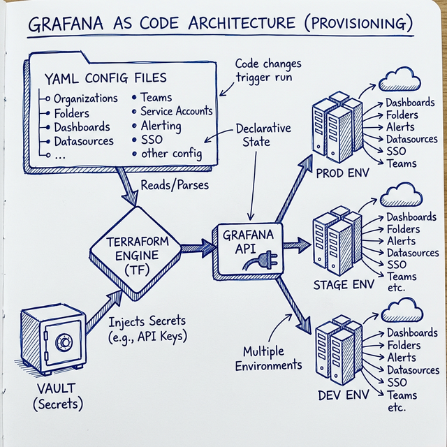
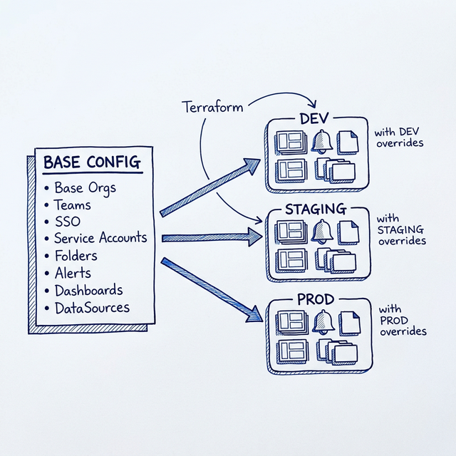
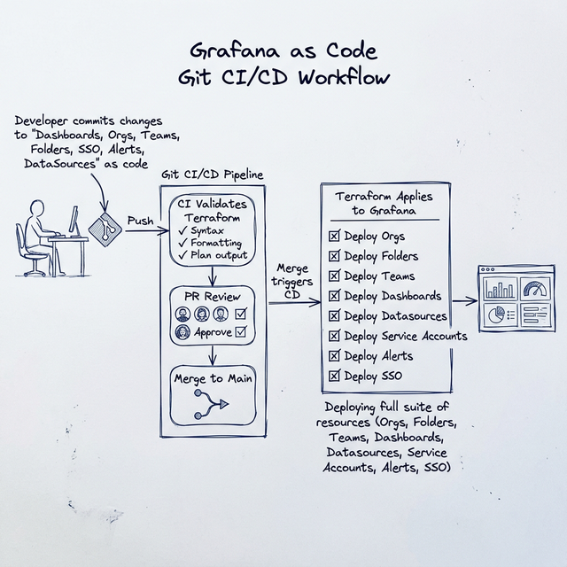

# Grafana as Code

[](https://terraform.io)
[](https://registry.terraform.io/providers/grafana/grafana)
[](https://www.vaultproject.io/)
[](https://pre-commit.com)
[](https://opensource.org/licenses/MIT)

Manage your entire Grafana instance as code — organizations, dashboards, datasources, folders, teams, alerting, SSO — all defined in YAML, version-controlled, and deployed with Terraform.



---

## Prerequisites

- **Terraform** >= 1.6.0
- **Python 3** (used by the import script)
- **curl** (used by API scripts)
- **Grafana** instance with admin access (basic auth or service account token)
- **HashiCorp Vault** for secrets management
- **Docker** *(optional)* for local development
- **Keycloak** *(optional)* for SSO

---

## Quick-Start (5 minutes)

### Already have a Grafana running? Import it.

```bash
# 1. Export your Vault token (required for Terraform)
export VAULT_TOKEN="your-token"

# 2. Import everything — YAML files + Terraform state, all in one command
make import ENV=prod \
  GRAFANA_URL=https://grafana.example.com \
  AUTH=admin:password

# 3. Verify — should show NO changes
#    (import already ran `terraform init` for you)
make plan ENV=prod

# 4. Done. From now on: edit YAML → plan → apply.
#    If you come back later or switch machines, run `make init` first.
```

### Starting from scratch?

```bash
make new-env NAME=staging GRAFANA_URL=https://grafana.example.com
# Edit the generated YAML files in envs/staging/
make vault-setup ENV=staging
make init ENV=staging && make plan ENV=staging && make apply ENV=staging
```

### Local development?

```bash
make dev-up                      # Starts Grafana + Vault + Keycloak via Docker
make dev-bootstrap               # Seeds Vault and creates dev env
export VAULT_TOKEN=root
make init ENV=dev && make plan ENV=dev && make apply ENV=dev
```

---

## Command Cheat Sheet

Run `make help` for the full list. Here are the commands you'll use 95% of the time:

| What you want to do | Command |
|---------------------|---------|
| **Import** existing Grafana | `make import ENV=prod GRAFANA_URL=... AUTH=...` |
| Import (YAML only, no TF state) | `make import ... NO_TF_IMPORT=true` |
| Import (skip dashboards) | `make import ... NO_DASHBOARDS=true` |
| **Initialize** Terraform | `make init ENV=prod` |
| **Preview** changes | `make plan ENV=prod` |
| **Deploy** changes | `make apply ENV=prod` |
| Create a new environment | `make new-env NAME=staging GRAFANA_URL=...` |
| Validate YAML schemas | `make validate-config ENV=prod` |
| Detect drift | `make drift ENV=prod` |
| Set up Vault secrets | `make vault-setup ENV=prod` |
| Start local dev stack | `make dev-up` |

> **Tip:** Always `export VAULT_TOKEN=...` before running `plan`, `apply`, or `import`.

---

## Features

| Category | What it does |
|----------|-------------|
| **Import** | One command to import a running Grafana → YAML + Terraform state |
| **Multi-Environment** | `base/` + `envs/dev|staging|prod/` with override merging |
| **Multi-Organization** | Per-org subdirectories, all resource types scoped to `orgId` |
| **Dashboards** | Version-controlled JSON, organized by org → folder |
| **Nested Folders** | Directory-structure-driven, with team-based permissions |
| **Alerting** | Alert rules, 20+ contact point types, full notification policy routing trees |
| **Datasources** | All types, with optional Vault-managed secrets |
| **SSO** | OAuth2/OIDC: Keycloak, Okta, Azure AD — with wildcard org/group mappings |
| **Team Sync** | Keycloak → Grafana team membership sync (no Enterprise required) |
| **Secrets** | HashiCorp Vault integration for all sensitive values |
| **Validation** | YAML schema validation + pre-commit hooks |
| **CI/CD** | GitHub Actions / GitLab CI: lint → plan → apply pipeline |
| **Operations** | Drift detection, backup/restore, env promotion, dashboard diff |

---

## How It Works

**Day-to-day, you only touch 2 directories:**

| What you do | Where |
|-------------|-------|
| Edit shared config (all envs) | `base/` |
| Edit env-specific config | `envs/<env>/` |
| Run commands | `make plan ENV=prod` |

Everything under `terraform/`, `scripts/`, and `schemas/` is internal plumbing — you don't need to touch it.

### Project Structure

```
grafana-as-code/
│
├── base/                             ← Shared config (applied to ALL environments)
│   ├── organizations.yaml
│   ├── sso.yaml
│   ├── keycloak.yaml
│   ├── alerting/
│   │   └── _default/                 ← Shared alerting defaults (empty by default)
│   │       ├── alert_rules.yaml
│   │       ├── contact_points.yaml
│   │       └── notification_policies.yaml
│   ├── datasources/
│   │   └── _default/datasources.yaml
│   ├── folders/
│   │   └── _default/folders.yaml
│   ├── teams/
│   │   └── _default/teams.yaml
│   ├── service_accounts/
│   │   └── _default/service_accounts.yaml
│   └── dashboards/                   ← Shared dashboards
│       └── <Org>/<folder>/*.json
│
├── envs/                             ← Per-environment (overrides base)
│   └── <env>/
│       ├── terraform.tfvars          ← Terraform variables
│       ├── <env>.<type>.tfbackend    ← Backend config (auto-detected by make init)
│       ├── organizations.yaml        ← Environment-specific overrides
│       ├── sso.yaml
│       ├── keycloak.yaml
│       ├── datasources/              ← Per-org datasource files
│       │   └── <Org Name>/datasources.yaml
│       ├── folders/                  ← Per-org folder files
│       │   └── <Org Name>/folders.yaml
│       ├── teams/                    ← Per-org team files
│       │   └── <Org Name>/teams.yaml
│       ├── service_accounts/         ← Per-org service account files
│       │   └── <Org Name>/service_accounts.yaml
│       ├── alerting/                 ← Per-org alerting files
│       │   └── <Org Name>/
│       │       ├── alert_rules.yaml
│       │       ├── contact_points.yaml
│       │       └── notification_policies.yaml
│       └── dashboards/               ← Environment-specific dashboards
│           └── <Org>/<folder>/*.json
│
├── terraform/                        ← Infrastructure code (internal)
│   ├── main.tf
│   ├── variables.tf
│   ├── outputs.tf
│   ├── locals.tf
│   ├── backend.tf                    ← Backend type (auto-generated by `make init`, commit it)
│   ├── backend.tf.example            ← Reference for all backend options
│   └── modules/
│       ├── organizations/
│       ├── folders/
│       ├── datasources/
│       ├── dashboards/
│       ├── alerting/
│       ├── teams/
│       ├── service_accounts/
│       ├── sso/
│       └── keycloak/
│
├── scripts/                          ← Automation
│   ├── import_from_grafana.py        ← Import from existing Grafana
│   ├── validate_config.py            ← YAML schema validation
│   ├── new_env.py                    ← Create new environment
│   ├── check_env.py                  ← Validate environment structure
│   ├── delete_env.py
│   ├── promote.py
│   ├── backup.py
│   └── vault/                        ← Vault setup scripts
│       └── ...
│
├── schemas/                          ← YAML validation schemas
│   ├── datasources.schema.yaml
│   ├── folders.schema.yaml
│   ├── teams.schema.yaml
│   ├── service_accounts.schema.yaml
│   ├── alert_rules.schema.yaml
│   ├── contact_points.schema.yaml
│   ├── notification_policies.schema.yaml
│   └── organizations.schema.yaml
│
├── Makefile                          ← Entry point — run everything from here
├── README.md
├── .pre-commit-config.yaml           ← Git pre-commit hooks
├── docker-compose.yml                ← Local dev: Grafana + Vault + Keycloak
└── .github/ / .gitlab-ci.yml        ← CI/CD pipelines
```

### Merge Behavior

Environment files **override** base files that share the same merge key:

| Resource | Merge Key |
|----------|-----------|
| Organizations | `name` |
| Folders | `orgId:uid` |
| Datasources | `orgId:uid` |
| Teams | `name/orgId` |
| Service Accounts | `orgId:name` |
| Alert Rules | `orgId:folder-name` |
| Contact Points | `orgId:name` |
| Notification Policies | `orgId` |
| Dashboards | `filepath` |

### Multi-Organization Support

All resources are organized in **per-org subdirectories** within each environment:

```
envs/prod/
  datasources/
    Main Org./datasources.yaml    # orgId: 1
    Platform Team/datasources.yaml # orgId: 3
  alerting/
    Main Org./contact_points.yaml
    Platform Team/alert_rules.yaml
```

Each resource uses `orgId` (numeric) rather than org name:

```yaml
# envs/prod/datasources/Main Org./datasources.yaml
datasources:
  - name: "Prometheus"
    uid: "prometheus-main"
    orgId: 1         # numeric org ID
    type: "prometheus"
    url: "http://prometheus:9090"
```

---

## Import from Grafana

The `make import` command connects to a running Grafana, generates all YAML + dashboard JSON, and imports every resource into Terraform state — so `make plan` shows no changes afterward.

> **Note:** `export VAULT_TOKEN=...` before running `make import` — Terraform needs it during state import.

### What Gets Imported

| Resource | Output |
|----------|--------|
| Organizations | `envs/<env>/organizations.yaml` |
| Folders | `envs/<env>/folders/<Org>/folders.yaml` |
| Dashboards | `envs/<env>/dashboards/<Org>/<folder>/*.json` |
| Datasources | `envs/<env>/datasources/<Org>/datasources.yaml` |
| Teams | `envs/<env>/teams/<Org>/teams.yaml` |
| Service Accounts | `envs/<env>/service_accounts/<Org>/service_accounts.yaml` |
| Alert Rules | `envs/<env>/alerting/<Org>/alert_rules.yaml` |
| Contact Points | `envs/<env>/alerting/<Org>/contact_points.yaml` |
| Notification Policies | `envs/<env>/alerting/<Org>/notification_policies.yaml` |
| SSO | `envs/<env>/sso.yaml` |
| Terraform Variables | `envs/<env>/terraform.tfvars` |

### Usage

```bash
# Basic import (YAML + Terraform state)
make import ENV=prod \
  GRAFANA_URL=https://grafana.example.com \
  AUTH=admin:password

# Using an API token
make import ENV=prod \
  GRAFANA_URL=https://grafana.example.com \
  AUTH=glsa_xxxxxxxxxxxxx

# YAML only — skip terraform state import
make import ENV=prod \
  GRAFANA_URL=https://grafana.example.com \
  AUTH=admin:password \
  NO_TF_IMPORT=true

# Skip dashboard JSON export (faster, config-only)
make import ENV=prod \
  GRAFANA_URL=https://grafana.example.com \
  AUTH=admin:password \
  NO_DASHBOARDS=true
```

### After Importing

1. **Review** the YAML files — adjust names, roles, settings as needed
2. **Set up Vault** — `make vault-setup ENV=<env>` (datasource passwords aren't exported)
3. **Plan** — `make plan ENV=<env>` should show no changes
4. **Apply** — `make apply ENV=<env>` to converge any cosmetic drift

---

## Configuration Reference

Full YAML reference with all fields and examples: **[docs/configuration-reference.md](docs/configuration-reference.md)**

Quick examples of the most common configs:

### Organizations

```yaml
# base/organizations.yaml
organizations:
  - name: "Main Organization"
    id: 1
  - name: "Platform Team"
```

### Folders

```yaml
# envs/prod/folders/Main Organization/folders.yaml
folders:
  - title: "Infrastructure"
    uid: "infrastructure"
    orgId: 1
    permissions:
      - team: "SRE"
        permission: "Edit"
      - role: "Viewer"
        permission: "View"
```

### Datasources

```yaml
# envs/prod/datasources/Main Organization/datasources.yaml
datasources:
  - name: "Prometheus"
    type: "prometheus"
    uid: "prometheus"
    url: "http://prometheus:9090"
    orgId: 1
    is_default: true
    use_vault: true       # Secrets loaded from Vault
```

### SSO / OAuth2

```yaml
# envs/prod/sso.yaml
sso:
  enabled: true
  name: "Keycloak"
  auth_url: "https://sso.example.com/realms/main/protocol/openid-connect/auth"
  token_url: "https://sso.example.com/realms/main/protocol/openid-connect/token"
  api_url: "https://sso.example.com/realms/main/protocol/openid-connect/userinfo"
  client_id: "grafana"

  groups:
    - name: "sre-team"
      org_mappings:
        - orgId: 1
          role: "Admin"

    - name: "*"
      wildcard_group: true
      org_mappings:
        - orgId: "*"
          role: "Viewer"
```

> For **alerting**, **teams**, **service accounts**, and more — see the full [Configuration Reference](docs/configuration-reference.md).

---

## Terraform Workflow

```bash
make init  ENV=<env>     # Initialize Terraform
make plan  ENV=<env>     # Preview changes
make apply ENV=<env>     # Deploy
make destroy ENV=<env>   # Tear down (asks for confirmation)
```

---

## Environment Management



```bash
make new-env NAME=staging GRAFANA_URL=https://grafana.example.com
make list-envs
make check-env ENV=staging
make delete-env NAME=staging
make dry-run NAME=staging
```

### `new-env` Options

| Parameter | Description | Default |
|-----------|-------------|---------|
| `NAME` | *(required)* Environment name | — |
| `GRAFANA_URL` | Grafana instance URL | `http://localhost:3000` |
| `VAULT_ADDR` | Vault server address | `http://localhost:8200` |
| `VAULT_MOUNT` | Vault KV mount path | `grafana` |
| `KEYCLOAK_URL` | Keycloak URL (enables SSO config) | *(disabled)* |
| `BACKEND` | Backend type: `s3`, `azurerm`, `gcs`, `gitlab` | *(local)* |
| `ORGS` | Organizations (comma-separated) | *(from base config)* |
| `DATASOURCES` | Datasource presets (comma-separated) | *(empty)* |

### Backend Auto-Detection

`make init` automatically detects the backend type from the `.tfbackend` filename:

```
envs/<env>/<env>.<type>.tfbackend   →   terraform { backend "<type>" {} }
```

| File | Backend |
|------|---------|
| `prod.s3.tfbackend` | AWS S3 |
| `staging.azurerm.tfbackend` | Azure Blob Storage |
| `prod.gcs.tfbackend` | Google Cloud Storage |
| `staging.http.tfbackend` | GitLab HTTP state |
| `dev.local.tfbackend` | Local (default) |
| *(no file)* | Local |

The `terraform/backend.tf` file is **auto-generated** — never edit it manually.

---

## Operations

| Command | Description |
|---------|-------------|
| `make drift ENV=<env>` | Detect changes made outside Terraform |
| `make backup ENV=<env>` | Snapshot Grafana's live state via API |
| `make promote FROM=staging TO=prod` | Diff and copy configs between environments |
| `make dashboard-diff ENV=<env>` | Human-readable dashboard change summary |
| `make team-sync ENV=<env> ...` | Sync Keycloak → Grafana teams |

---

## Vault & Secrets

```bash
export VAULT_ADDR='http://127.0.0.1:8200'
export VAULT_TOKEN='your-root-token'

make vault-setup  ENV=<env>    # Create secrets
make vault-verify ENV=<env>    # Verify secrets exist
```

Datasources with `use_vault: true` automatically load credentials from Vault.

---

## CI/CD



### GitHub Actions

1. **On PR** — `fmt`, `validate`, YAML lint, schema validation, `terraform plan` as PR comment
2. **On merge** — `terraform apply` with environment protection
3. **On schedule** — Drift detection, creates GitHub Issue if changes found

### GitLab CI

1. **validate** — `fmt`, `validate`, YAML lint, schema validation, `tfsec`
2. **plan** — Per-environment plans
3. **apply** — Manual or auto-apply per env
4. **drift** — Scheduled pipeline

### Local Validation

```bash
make pre-commit-install    # One-time setup
make pre-commit-run        # Run all checks manually
make validate-config       # Schema-validate all YAML
make validate-config ENV=prod  # Single environment
```

---

## Troubleshooting

| Issue | Solution |
|-------|----------|
| `VAULT_TOKEN` errors | Export it: `export VAULT_TOKEN=root` (local) or your real token |
| `for_each` duplicate key | Ensure each org subdir has a unique name matching the Grafana org |
| `terraform plan` shows drift after import | Run `make apply` once — cosmetic drift (dashboard `message` etc.) is normal |
| Permission denied | Grafana credentials need `Admin` role |
| Vault secret not found | `make vault-verify ENV=<env>` then `make vault-setup ENV=<env>` |
| Resources already in state | The import script detects and silently skips them |
| Dashboard import fails | Check JSON syntax and that folder UID matches the directory name |
| SSO wildcard not working | Use `wildcard_group: true` for `name: "*"` groups |

---

## Contributing

1. Fork, create feature branch, `make pre-commit-install`
2. Make changes, commit (hooks run automatically)
3. Push, open PR

> Skip hooks for a one-off: `git commit --no-verify`

## License

MIT — see [LICENSE](LICENSE).
